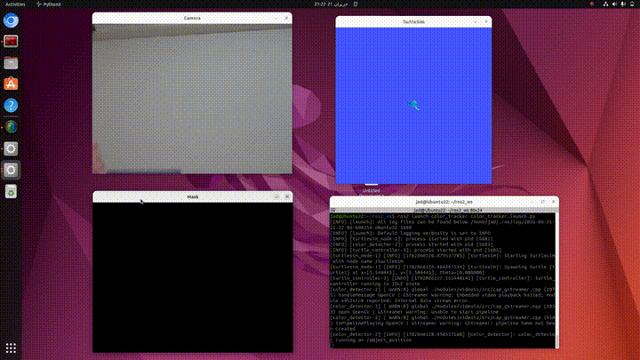

# Webcam Color Tracking with ROS2 and TurtleSim

A ROS2 (Humble) package that detects a colored object through a webcam and drives a TurtleSim turtle toward it in real time. OpenCV handles object detection and publishes the object's position over a ROS2 topic. A controller node runs a behavioral state machine to move the turtle accordingly.

## Demo



## Architecture

```
webcam --> color_detector --> /object_position --> turtle_controller --> /turtle1/cmd_vel --> turtlesim
           (OpenCV HSV          (geometry_msgs/                           (geometry_msgs/
            thresholding)        Point)                                   Twist)
```

**color_detector** captures frames from the webcam using a dedicated grab thread to always work on the most recent frame, converts to HSV, applies a color threshold to produce a binary mask, cleans the mask with morphological operations, and publishes the pixel centroid of the largest matching blob on `/object_position`. The `z` field of the `Point` message acts as a detection flag.

**turtle_controller** subscribes to `/object_position` and `/turtle1/pose`, maps pixel coordinates into the turtle's coordinate space (inverting the y axis since image y points down and turtle y points up), and drives the turtle using a proportional controller on distance and heading error.

## State Machine

The controller uses a six-state behavioral state machine to handle detection, loss, and recovery of the tracked object.

| State | Behavior |
|---|---|
| IDLE | Waiting for the first detection. Turtle holds position. |
| TRACKING | Object detected and far. Turtle drives toward it. |
| FOLLOWING | Object detected and close. Turtle stays locked on. |
| LOST_TARGET | Object just disappeared. Turtle holds position briefly. |
| SEARCHING | Object missing for 5 s. Turtle spins in place to scan. |
| STOP | Object not found after 10 s of searching. Turtle stops. |

Hysteresis thresholds between TRACKING and FOLLOWING prevent state flickering at the boundary distance. The turtle re-enters the active states from any point if the object reappears.

## Tech Stack

- ROS2 Humble
- Python 3
- OpenCV
- TurtleSim

## Setup

Clone into the `src` folder of a ROS2 workspace and build:

```bash
cd ~/ros2_ws/src
git clone https://github.com/<your-username>/color_tracker.git
cd ~/ros2_ws
colcon build --packages-select color_tracker --symlink-install
source install/setup.bash
```

## Run

Start everything with the launch file:

```bash
ros2 launch color_tracker color_tracker.launch.py
```

Or run each node in a separate terminal:

```bash
ros2 run turtlesim turtlesim_node
ros2 run color_tracker color_detector
ros2 run color_tracker turtle_controller
```

Hold your colored object in front of the camera and the turtle will follow it.

## Color Tuning

The HSV range in `color_detector.py` (`self.lower` and `self.upper`) targets a specific color. To track a different object, determine its HSV range with a trackbar tool and update those two arrays. Brightly saturated colors produce the most reliable masks.

## Possible Improvements

- Expose HSV thresholds and controller gains as ROS2 parameters
- Replace the `z` visibility flag with a dedicated custom message
- Apply velocity smoothing for steadier turtle motion
- Support tracking multiple objects simultaneously

## License

MIT
